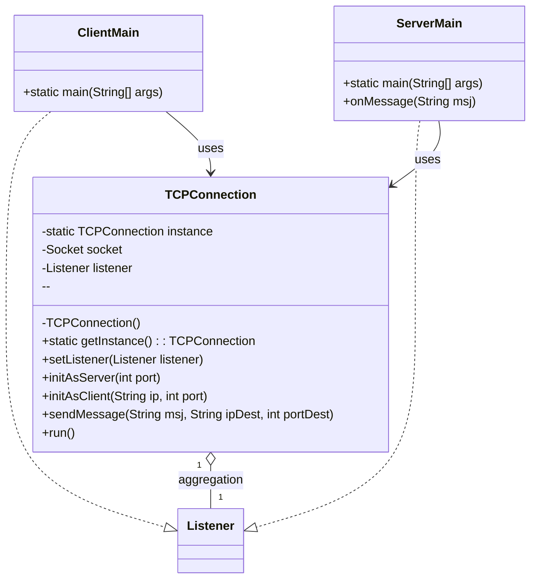
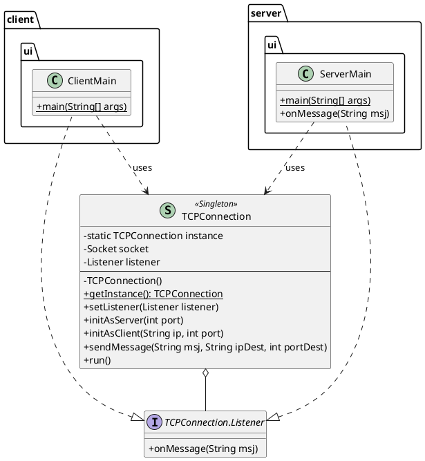

# Proyecto de Conexión TCP en Java

Este proyecto implementa una conexión TCP básica en Java, demostrando la comunicación entre un cliente y un servidor. Utiliza un enfoque de Singleton para gestionar la conexión y un patrón de Listener para manejar los mensajes entrantes.

## Resumen de `TCPConnection.java`

La clase `util.TCPConnection` es el núcleo de la comunicación en este proyecto. Está diseñada para ser versátil y manejar tanto la lógica del cliente como la del servidor.

- **Singleton:** La clase utiliza el patrón de diseño Singleton, asegurando que solo exista una única instancia de la conexión (`getInstance()`). Esto centraliza el manejo del socket y la comunicación.
- **Rol Dual (Servidor/Cliente):**
  - `initAsServer(port)`: Configura la instancia para que actúe como un servidor. Espera y acepta una conexión de un cliente en el puerto especificado.
  - `initAsClient(ip, port)`: Configura la instancia para que actúe como un cliente, conectándose a un servidor en una IP y puerto específicos.
- **Recepción de Mensajes:**
  - La clase hereda de `Thread`. Su método `run()` se encarga de escuchar de forma pasiva los mensajes que llegan a través del socket.
  - Cuando se recibe un mensaje, se notifica a un `Listener` que ha sido registrado.
- **Envío de Mensajes:**
  - El método `sendMessage(msj, ipDest, portDest)` permite enviar mensajes. Es importante destacar que para cada envío, se crea un nuevo `Thread` y un nuevo `Socket`, se envía el mensaje y se cierra la conexión. Esto lo hace adecuado para mensajes puntuales más que para un flujo de datos constante.
- **Patrón Listener:**
  - La interfaz interna `TCPConnection.Listener` define un método `onMessage(String msj)`.
  - Las clases interesadas en recibir notificaciones de mensajes (como la UI del servidor) deben implementar esta interfaz y registrarse usando `setListener(listener)`.

## Uso por parte del Cliente y Servidor

### `server/src/main/java/ui/Main.java` (Servidor)

El `Main` del servidor actúa como el receptor de los mensajes.

1. **Implementa `TCPConnection.Listener`:** La clase `Main` del servidor implementa la interfaz para poder procesar los mensajes recibidos.
2. **Inicialización:** Obtiene la instancia Singleton de `TCPConnection`.
3. **Configuración como Servidor:** Llama a `connection.initAsServer(5000)` para que el socket espere una conexión en el puerto 5000.
4. **Registro del Listener:** Se registra a sí mismo (`connection.setListener(m)`) para que `TCPConnection` sepa a quién notificar cuando llegue un mensaje.
5. **Inicio de Escucha:** Llama a `connection.start()`, lo que ejecuta el método `run()` del hilo de `TCPConnection` para comenzar a escuchar activamente.
6. **Procesamiento de Mensajes:** El método `onMessage(String msj)` se ejecuta automáticamente cuando se recibe un mensaje, el cual es simplemente impreso en la consola.

### `client/src/main/java/ui/Main.java` (Cliente)

El `Main` del cliente actúa como el emisor del mensaje.

1. **Obtiene la Instancia:** Al igual que el servidor, obtiene la instancia Singleton de `TCPConnection`.
2. **Envío Directo:** Llama directamente a `connection.sendMessage("Hola desde el cliente", "127.0.0.1", 5000)`. Este método se encarga de crear una conexión temporal con el servidor en la IP y puerto especificados, enviar el mensaje y cerrar la conexión. No necesita llamar a `initAsClient` ni a `start` para este envío puntual.

## Diagrama UML (PlantUML)

