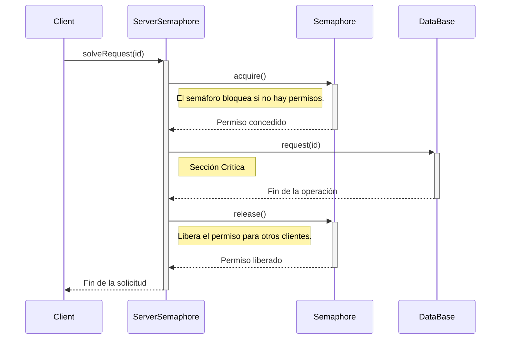

# Proyecto de Semáforos en Java

Este proyecto demuestra el uso de la clase `java.util.concurrent.Semaphore` para controlar el acceso concurrente a un recurso compartido. A continuación se describe el comportamiento de las clases principales y cómo interactúan entre sí.

## Resumen de Clases

### `Client.java`

La clase `Client` representa a un cliente que necesita acceder a un recurso compartido a través de un servidor.

- **Rol**: Simula una entidad que solicita un servicio.
- **Implementación**: Implementa la interfaz `Runnable`, lo que permite que cada cliente se ejecute en un hilo separado.
- **Comportamiento**: Al ejecutarse, el cliente imprime un mensaje indicando que está solicitando el recurso y luego llama al método `solveRequest()` del servidor al que está conectado.

### `DataBase.java`

La clase `DataBase` simula un recurso compartido al que no se debe acceder de forma concurrente sin control.

- **Rol**: Representa el recurso crítico o la "sección crítica" del código.
- **Comportamiento**: El método `request(clientId)` simula una operación que consume tiempo (usando `Thread.sleep(1000)`). Imprime mensajes al inicio y al final de la operación para mostrar cuándo un cliente está utilizando el recurso.

### `ServerSemaphore.java`

Esta clase actúa como un intermediario que gestiona el acceso de los clientes a la `DataBase` utilizando un semáforo.

- **Rol**: Proteger el recurso (`DataBase`) de accesos concurrentes descontrolados.
- **Componente Clave**: Utiliza una instancia de `java.util.concurrent.Semaphore`.

## Interacción y Uso de `Semaphore`

El objetivo principal es garantizar que solo un cliente pueda acceder al método `request()` de la `DataBase` a la vez; esto se logra mediante un semáforo.

1. **Inicialización**: En el constructor de `ServerSemaphore`, el semáforo se inicializa con `new Semaphore(1)`. Esto significa que el semáforo tiene **un solo permiso** disponible. Alternativamente podría inicializarse como `new Semaphore(3)` para otorgar **tres (3)** permisos simultaneos. 

2. **Adquisición del Permiso**: Cuando un `Client` llama al método `solveRequest()`, la primera acción del servidor es invocar `semaphore.acquire()`.
   
   - Si el permiso está disponible, el hilo del cliente lo adquiere, el contador de permisos del semáforo baja a 0 y el cliente procede a ejecutar el método `dataBase.request()`.
   - Si el permiso no está disponible (porque otro cliente ya lo tiene), el hilo del cliente se **bloquea** y queda en espera hasta que el permiso se libere.

3. **Liberación del Permiso**: Una vez que el cliente termina de usar el recurso (`dataBase.request()`), el permiso **debe** ser liberado para que otros clientes en espera puedan usarlo. Esto se hace llamando a `semaphore.release()`.
   
   - Para garantizar que el permiso siempre se libere, incluso si ocurren excepciones, la llamada a `release()` se coloca dentro de un bloque `finally`.
   - Cuando se libera el permiso, el contador del semáforo vuelve a 1, y el siguiente cliente que estaba esperando (si lo hay) puede adquirirlo.

Este mecanismo asegura un acceso ordenado y secuencial a la sección crítica, evitando condiciones de carrera y garantizando la integridad de los datos.

## Diagrama de Secuencia

A continuación se muestra el flujo de interacción entre un cliente, el servidor con semáforo y la base de datos.

