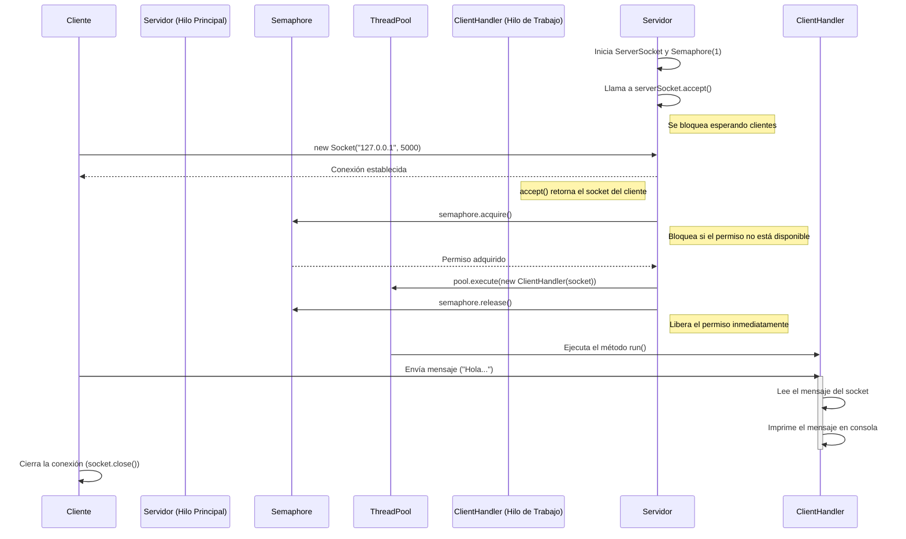

###### Resumen del Proyecto

Este proyecto demuestra una aplicación cliente-servidor simple en Java que utiliza Sockets para la comunicación y un Thread Pool en el lado del servidor para manejar las conexiones de los clientes.

## Comportamiento de las Clases

### 1. `client/src/main/java/ui/Main.java` (Cliente)

La clase `Main` del cliente es responsable de iniciar una conexión con el servidor.

- Crea un `Socket` para conectarse al servidor en la dirección `127.0.0.1` y el puerto `5000`.
- Una vez conectado, envía un único mensaje de texto al servidor.
- Después de enviar el mensaje, espera un segundo, y luego cierra la conexión y el socket.

### 2. `server/src/main/java/ui/Main.java` (Servidor)

Esta es la clase principal del servidor, encargada de gestionar las conexiones entrantes.

- Inicia un `ServerSocket` que escucha en el puerto `5000`.
- Utiliza un `ExecutorService` (un Thread Pool) con un tamaño fijo de **un solo hilo** para procesar las solicitudes de los clientes.
- También inicializa un `Semaphore` con un solo permiso, que junto con el hilo único, asegura que solo se maneje una conexión de cliente a la vez.
- Entra en un bucle infinito (`while(true)`) para aceptar continuamente las conexiones de los clientes (`serverSocker.accept()`).
- Por cada conexión aceptada, crea una nueva instancia de `ClientHandler` y la envía al Thread Pool para su ejecución.

### 3. `server/src/main/java/ui/ClientHandler.java` (Manejador de Cliente)

La clase `ClientHandler` implementa la interfaz `Runnable` y su propósito es manejar la lógica de comunicación para un único cliente.

- Cada instancia de `ClientHandler` se asocia con el `Socket` de un cliente específico.
- Cuando el hilo del Thread Pool ejecuta el método `run()`, este lee la línea de texto enviada por el cliente.
- Imprime el mensaje recibido en la consola del servidor, junto con la dirección IP y el puerto del cliente.
- Una vez que el mensaje es leído y mostrado, el método `run()` finaliza, y con él, la tarea del hilo para ese cliente.

### Interacción entre las Clases

1. El **Servidor (`server.Main`)** se inicia y se queda esperando conexiones en el puerto 5000.
2. El **Cliente (`client.Main`)** se ejecuta y establece una conexión con el servidor.
3. El **Servidor** acepta la conexión y crea un objeto `Socket` para comunicarse con ese cliente.
4. Inmediatamente, el Servidor crea una tarea `ClientHandler`, le pasa el socket del cliente y la delega al `ExecutorService` (Thread Pool).
5. El único hilo disponible en el pool toma la tarea `ClientHandler` y ejecuta su método `run()`.
6. Mientras tanto, el **Cliente** envía su mensaje.
7. El `ClientHandler` (ejecutándose en el servidor) lee el mensaje y lo muestra en la consola del servidor.
8. El **Cliente** cierra su conexión.
9. El `ClientHandler` finaliza su ejecución. El servidor queda a la espera de nuevas conexiones.

---

## Diagrama de Secuencia (Conexión Cliente-Servidor)

Este diagrama muestra el flujo de eventos desde que el cliente se conecta hasta que el servidor procesa su mensaje.

